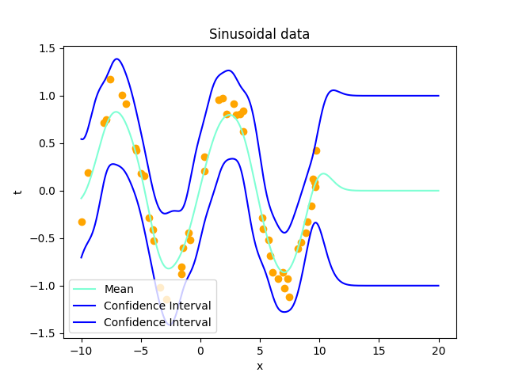

# Updated: Gaussian Processes for regression

The repository contains the code implementation of Gaussian Processes for regression, updated with a new dataset



## How to run the code
1) Install the Python modules in ```requirements.txt```
2) Run the Jupyter Notebook